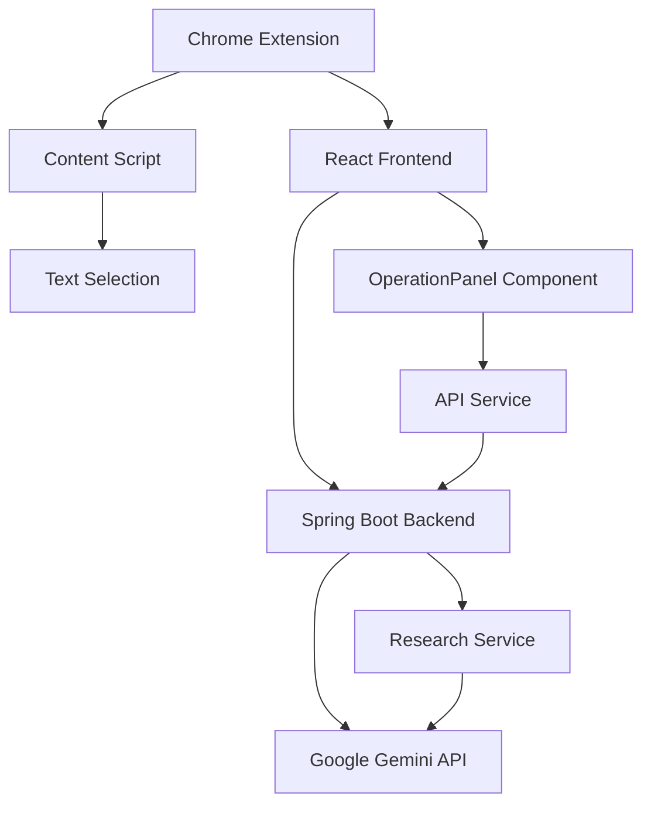

# 🤖 IA-Addon: Research Assistant Chrome Extension

<div align="center">


**Uma extensão Chrome inteligente para pesquisa e análise de texto usando IA**

[🚀 **Instalar**](#instalação) • [📖 **Documentação**](#funcionalidades) • [⚙️ **Configuração**](#configuração) • [🛠️ **Desenvolvimento**](#desenvolvimento)

</div>

---

## 📋 Índice

- [🎯 Visão Geral](#visão-geral)
- [✨ Funcionalidades](#funcionalidades)
- [🏗️ Arquitetura](#arquitetura)
- [🚀 Instalação](#instalação)
- [⚙️ Configuração](#configuração)
- [🛠️ Desenvolvimento](#desenvolvimento)
- [📁 Estrutura do Projeto](#estrutura-do-projeto)
- [🔧 Tecnologias](#tecnologias)
- [🤝 Contribuição](#contribuição)
- [📄 Licença](#licença)

---

## 🎯 Visão Geral

O **IA-Addon** é uma extensão Chrome moderna que transforma sua experiência de navegação com capacidades de IA avançadas. Desenvolvida com React, Spring Boot e integração com Google Gemini API, oferece funcionalidades inteligentes para pesquisa, análise e tradução de conteúdo web.

### 🎨 Características Principais

- **🔍 Análise Inteligente**: Resuma, analise e traduza qualquer texto selecionado
- **🌙 Modo Escuro**: Interface adaptável com tema claro/escuro
- **⚡ Performance**: Resposta rápida e eficiente
- **🎯 Precisão**: Integração com Google Gemini para resultados de alta qualidade
- **📱 Responsivo**: Interface moderna e intuitiva
- **🧹 Código Otimizado**: Arquitetura limpa e sem duplicações

---

## ✨ Funcionalidades

### 🧠 Operações de IA

| Operação | Descrição | Exemplo de Uso |
|----------|-----------|----------------|
| **📝 Resumir** | Gera resumos concisos e objetivos | Artigos longos → Resumo executivo |
| **🔍 Analisar** | Análise detalhada do conteúdo | Textos complexos → Análise crítica |
| **🌐 Traduzir** | Tradução para português brasileiro | Conteúdo em inglês → Português |

### 🎨 Interface

- **Side Panel**: Acesso rápido via painel lateral do Chrome
- **Dark Mode**: Alternância automática entre temas
- **Responsivo**: Adaptável a diferentes tamanhos de tela
- **Intuitivo**: Interface limpa e fácil de usar
- **Unificado**: Componente único com todas as funcionalidades

---

## 🏗️ Arquitetura



### 🔧 Componentes Principais

- **Frontend**: React + Tailwind CSS (Otimizado)
- **Backend**: Spring Boot + WebFlux
- **IA**: Google Gemini API
- **Build**: Webpack + Babel
- **Arquitetura**: Código limpo e sem duplicações

---

## 🚀 Instalação

### 📋 Pré-requisitos

- [Node.js](https://nodejs.org/) (v16+)
- [Java](https://adoptium.net/) (v17+)
- [Maven](https://maven.apache.org/) (v3.6+)
- [Google Gemini API Key](https://makersuite.google.com/app/apikey)

### 🔧 Passos de Instalação

#### 1. Clone o Repositório
```bash
git clone https://github.com/MuketaUeda/IA-Addon.git
cd IA-Addon
```

#### 2. Configure o Backend
```bash
cd research-assistant
# Configure sua API key no application.properties
echo "gemini.api.key=sua_chave_aqui" >> src/main/resources/application.properties
mvn spring-boot:run
```

#### 3. Configure o Frontend
```bash
cd ../research-assistant-react
npm install
npm run build
```

#### 4. Instale a Extensão
1. Abra o Chrome e vá para `chrome://extensions/`
2. Ative o "Modo desenvolvedor"
3. Clique em "Carregar sem compactação"
4. Selecione a pasta `research-assistant-react/dist`

---

## ⚙️ Configuração

### 🔑 API Key do Google Gemini

1. Acesse [Google AI Studio](https://makersuite.google.com/app/apikey)
2. Crie uma nova API key
3. Configure no arquivo `research-assistant/src/main/resources/application.properties`:

```properties
gemini.api.url=https://generativelanguage.googleapis.com/v1beta/models/gemini-pro:generateContent?key=
gemini.api.key=SUA_API_KEY_AQUI
```

### 🌐 Configurações do Servidor

```properties
# Porta do servidor (padrão: 8080)
server.port=8080

# CORS para desenvolvimento
spring.web.cors.allowed-origins=*
```

---

## 🛠️ Desenvolvimento

### 🚀 Scripts Disponíveis

#### Frontend (React)
```bash
cd research-assistant-react

# Desenvolvimento com hot reload
npm run dev

# Build de produção
npm run build

# Servidor de desenvolvimento
npm start
```

#### Backend (Spring Boot)
```bash
cd research-assistant

# Executar em modo desenvolvimento
mvn spring-boot:run

# Build do projeto
mvn clean package

# Executar testes
mvn test
```

### 📁 Estrutura de Desenvolvimento

```
IA-Addon/
├── research-assistant/          # Backend Spring Boot
│   ├── src/main/java/
│   │   └── com/research/assistant/
│   │       ├── ResearchController.java
│   │       ├── ResearchService.java
│   │       ├── ResearchRequest.java
│   │       └── GeminiResponse.java
│   └── src/main/resources/
│       └── application.properties
│
└── research-assistant-react/    # Frontend React (Otimizado)
    ├── src/
    │   ├── components/
    │   │   └── OperationPanel.jsx    # Componente principal unificado
    │   ├── services/
    │   │   └── api.js               # Serviço de comunicação com backend
    │   ├── background.js            # Service worker da extensão
    │   ├── content.js               # Script para captura de texto
    │   ├── sidepanel.jsx            # Ponto de entrada do painel lateral
    │   └── sidepanel.html           # Template HTML
    ├── webpack.config.js            # Configuração de build
    └── tailwind.config.js           # Configuração do Tailwind CSS
```

---

## 📁 Estrutura do Projeto

### 🔧 Backend (Spring Boot)

| Arquivo | Descrição |
|---------|-----------|
| `ResearchController.java` | Controlador REST para endpoints da API |
| `ResearchService.java` | Serviço principal com lógica de IA |
| `ResearchRequest.java` | DTO para requisições |
| `GeminiResponse.java` | Modelo de resposta da API Gemini |

### 🎨 Frontend (React) - Otimizado

| Arquivo | Descrição |
|---------|-----------|
| `OperationPanel.jsx` | Componente principal unificado com todas as funcionalidades |
| `api.js` | Serviço de comunicação com backend |
| `background.js` | Service worker da extensão |
| `content.js` | Script de conteúdo para captura de texto |
| `sidepanel.jsx` | Ponto de entrada do painel lateral |
| `sidepanel.html` | Template HTML do painel lateral |

---

## 🔧 Tecnologias

### 🎨 Frontend
- **React 18.2.0**: Biblioteca JavaScript para interfaces
- **Tailwind CSS 3.3.2**: Framework CSS utilitário
- **Webpack 5.88.0**: Bundler e build tool
- **Babel**: Transpilador JavaScript

### ⚙️ Backend
- **Spring Boot 3.5.4**: Framework Java
- **Spring WebFlux**: Programação reativa
- **Lombok**: Redução de boilerplate
- **Jackson**: Serialização JSON

### 🤖 IA
- **Google Gemini API**: Modelo de linguagem avançado
- **WebClient**: Cliente HTTP reativo

---

### 📦 Build de Produção

```bash
# Backend
cd research-assistant
mvn clean package -DskipTests

# Frontend
cd ../research-assistant-react
npm run build
```

### 🐳 Docker (Opcional)

```dockerfile
# Dockerfile para o backend
FROM openjdk:17-jdk-slim
COPY target/research-assistant-*.jar app.jar
EXPOSE 8080
ENTRYPOINT ["java", "-jar", "/app.jar"]
```

---

## 🤝 Contribuição

### 📝 Como Contribuir

1. **Fork** o projeto
2. Crie uma **branch** para sua feature (`git checkout -b feature/AmazingFeature`)
3. **Commit** suas mudanças (`git commit -m 'Add some AmazingFeature'`)
4. **Push** para a branch (`git push origin feature/AmazingFeature`)
5. Abra um **Pull Request**

### 🐛 Reportando Bugs

- Use o [GitHub Issues](https://github.com/MuketaUeda/IA-Addon/issues)
- Inclua detalhes sobre o ambiente e passos para reproduzir

### 💡 Sugestões

- Abra uma [Discussion](https://github.com/MuketaUeda/IA-Addon/discussions)
- Compartilhe ideias para novas funcionalidades

---

## 📄 Licença

Este projeto está licenciado sob a **MIT License** - veja o arquivo [LICENSE](LICENSE) para detalhes.

---

## 🙏 Agradecimentos

- [Google Gemini](https://ai.google.dev/) pela API de IA
- [React](https://reactjs.org/) pela biblioteca frontend
- [Spring Boot](https://spring.io/projects/spring-boot) pelo framework backend
- [Tailwind CSS](https://tailwindcss.com/) pelo framework CSS

---

<div align="center">

**⭐ Se este projeto te ajudou, considere dar uma estrela!**

[](https://github.com/MuketaUeda/IA-Addon)
[](https://github.com/MuketaUeda/IA-Addon)
[](https://github.com/MuketaUeda/IA-Addon/issues)

</div>